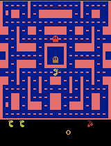
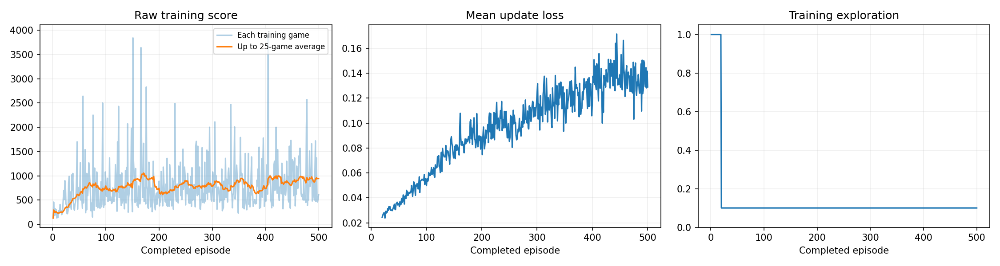

# Ms. Pac Man agent trained with Deep Q Learning

**Berkeley Haas, Foundations of Agentic AI (Fall 2026), Assignment 2**
Author: Tomas Diez Canedo · Course index: [haas-ai-fall-2026](https://github.com/tomas10k/haas-ai-fall-2026)

I trained a Deep Q Network (DQN) to play Ms. Pac Man for 500 games on a Colab T4 GPU, then ran a second experiment with a **10× larger replay memory**. The submitted run (run 2) raised the mean evaluation score from **492 to 704 (+43%)**. Its training scores kept climbing to a **~916 average over the last 100 games**, compared with ~712 for my first run.

**Submitted run (run 2): the same five evaluation games before and after training**

| Seed | Untrained | Trained |
|---|---|---|
| 101 | 350 | 350 |
| 202 | 500 | 1,120 |
| 303 | 320 | 390 |
| 404 | 800 | 430 |
| 505 | 490 | 1,230 |
| **Mean** | **492** | **704** |

Untrained agent | Best trained evaluation game (first 20 s, 4× speed)
:---:|:---:
 | 



---

## 1. Overview and setup

The notebook [`pacman_dqn.ipynb`](pacman_dqn.ipynb) is based on the course template ([pepealonso95/pacman-dqn](https://github.com/pepealonso95/pacman-dqn)). I changed only settings. The learning code and all evaluation settings are untouched.

**To reproduce:**
1. Open the notebook in Google Colab and select **Runtime → Change runtime type → T4 GPU**.
2. Use the values in section 2 below: the three choices in notebook section 1, and three memory settings in the "fixed experiment settings" cell.
3. Choose **Runtime → Run all**. Setup installs the pinned packages automatically (see [`requirements.txt`](requirements.txt)).

To run locally, use Python 3.11 to 3.13: `pip install -r requirements.txt`, then open the notebook in Jupyter or VS Code.

## 2. My choices

**The three required choices**

| Setting | Run 1 | Run 2 (submitted) | Template | Why |
|---|---|---|---|---|
| Exploration | 0.10 | **0.10** | 0.20 | Evaluation always uses 5% random moves. Training at 10% keeps enough randomness to find new routes, while most training moves follow the agent's own strategy, so it practices the game it will be scored on. 0.10 is also the final exploration level in DeepMind's original DQN paper. |
| Episodes | 500 | **500** | 100 | A 5 game smoke test took 10 seconds on the T4, so 500 games (about 20 minutes) was affordable. I kept 500 in run 2 so the comparison isolates the effect of memory, not training length. |
| Learning rate | 0.00025 | **0.0001** | 0.0001 | Run 1 used the DQN paper's 0.00025 to learn faster. In run 2 I lowered it, because smaller, steadier updates suit a larger and more varied memory. |

**Additional settings changed in run 2** (fixed experiment settings cell)

| Setting | Template | Run 2 | Why |
|---|---|---|---|
| `REPLAY_CAPACITY` | 5,000 | **50,000** | The template remembers only about 8 games of experience, so the agent keeps relearning its latest games and forgetting older lessons. 50,000 decisions covers about 80 games (about 1.8 GB of RAM). |
| `WARMUP_STEPS` | 1,000 | **10,000** | Fills the memory with more varied random play before learning starts |
| `TARGET_EVERY` | 1,000 | **2,000** | Refreshes the stable "target" copy of the network less often, giving learning a steadier reference |

Unchanged on purpose: `MAX_STEPS`, `FRAME_SKIP`, `EVAL_SEEDS` and `EVAL_EXPLORATION`, so that before and after scores stay comparable with the rest of the class.

## 3. Expected vs. observed

**Expected (run 1):** steady improvement across 500 games, and better scores in every evaluation game.

**Observed (run 1):** the mean rose from 492 to 702, but training scores **flattened after about 100 games** at roughly 700, while loss kept rising. My reading was that the tiny memory, not the number of games, was the constraint.

**Expected (run 2):** with 10× the memory, learning should keep improving instead of stalling.

**Observed (run 2):**
* **Training ended higher and was still rising.** By 100 game blocks, the average training score went 627 → 818 → 788 → 790 → 916. Run 1 ended at 712.
* **Big games became far more common:** 15 training games scored over 2,000, compared with 3 in run 1. The best game was 3,920.
* **The evaluation mean barely moved** (702 → 704). The five evaluation games range from 350 to 1,230, so the mean can swing by roughly ±170 on luck alone. Five games can't separate the two runs. The training curve is the stronger evidence that run 2 learned more.
* **Not every game improved.** Seed 404 dropped from 800 to 430, and seed 101 stayed at 350.
* **Loss rose steadily (0.03 → 0.13) while scores rose too.** Lower loss does not mean better play. In DQN, loss often grows as the agent's value estimates grow and it reaches new parts of the maze.
* **The periodic single game checks were volatile** (for example, 940 at game 200 and 310 at game 225), so any one GIF is an illustration, not evidence.

| | Run 1 | Run 2 (submitted) |
|---|---|---|
| Evaluation mean (5 games) | 702 | 704 |
| Games that improved vs. untrained | 4 of 5 | 3 of 5 (1 tied) |
| Training average, last 100 games | 712 | **916** |
| Training games above 2,000 | 3 | **15** |
| Best training game | 4,080 | 3,920 |

Run 1's files are kept in [`results/run1/`](results/run1/). A 5 game smoke test (template settings) scored 642, but that came almost entirely from one lucky 1,750 point game, an early lesson in reading small samples carefully.

## 4. Training metrics (run 2)

| Metric | Value |
|---|---|
| Completed episodes | 500 of 500 |
| Agent decisions | 306,398 |
| Learning updates | 74,100 |
| Training time | 1,386 s (about 23 min, including periodic samples) |
| Hardware | Google Colab, NVIDIA T4 GPU (CUDA), Linux |
| Software | Python 3.13.15, PyTorch 2.11.0, Gymnasium 1.3.0, ALE 0.11.2 |
| Evaluation | Same 5 seeds (101 to 505), 5% exploration, 3,000 decision cap |

Full settings and versions are in [`results/config.json`](results/config.json), with per game history in [`results/training.csv`](results/training.csv).

## 5. How the agent works, in plain language

* **Observations (what it sees):** the game screen, shrunk to 84 × 84 grayscale pixels. The agent sees the last **four** screens stacked together, so it can tell which way the ghosts are moving, which a single still image can't show. It makes a decision every fourth frame.
* **Actions (what it can do):** 9 joystick moves: stay still, up, down, left, right, and the four diagonals. For each screen, the network estimates how many future points each move will lead to, and picks the highest (except when it explores at random).
* **Rewards (what it learns from):** the game score: 10 points for a dot, 50 for a power pellet, 200 to 1,600 for eating ghosts, and more for fruit. During training each reward is **clipped to +1**. Reported scores are the real game scores.
* **How it learns:** it stores recent decisions in a replay memory, and every 4 decisions it studies a random batch of 32. It nudges each estimate toward *reward now + 0.99 × best estimated value of the next screen*, using a slower moving copy of itself as a stable target. Random batches from a large memory break the link between back to back moments, which is the likely reason the larger memory helped in run 2.

## 6. One limitation

**Reward clipping hides the value of a big play.** Because every reward is clipped to +1, eating a ghost (200 to 1,600 points) teaches the same lesson as eating one dot (10 points). The agent has little reason to go after power pellets and hunt ghosts, which is where the big Ms. Pac Man scores come from.

Other constraints: five evaluation games is a small sample, and the notebook evaluates the *final* network rather than the best checkpoint, even though the policy swings between stronger and weaker versions during training.

## 7. Next experiment

Keep run 2's memory settings and lower **exploration to 0.05**, so training matches the 5% used in evaluation. With a large memory there is already plenty of variety, so less random play should turn more of what the agent knows into points. After that, I would test removing reward clipping (for example, scaling rewards by 1/100 instead), so the agent learns that ghosts are worth far more than dots.

## Repository contents

```
pacman_dqn.ipynb            executed notebook (run 2), outputs included
pacman_player.py            optional local popup player (from template)
requirements.txt            pinned dependencies
results/
  comparison.json           all 5 before and after scores (run 2)
  baseline.json             untrained scores
  demo_scores.json          single game checks every 25 games
  training.csv              one row per training game
  training_summary.json     episodes, decisions, updates, time
  config.json               settings, hardware, package versions
  training_dashboard.png    score, loss and exploration plots
  untrained.gif             gameplay before training
  final_best.gif            best of the five trained evaluation games
  progress/                 gameplay samples every 100 games
  run1/                     the same files for run 1 (small memory)
```

Model checkpoints (`*.pt`, about 7 MB each) are left out to keep the repo small, per the course guidance.
